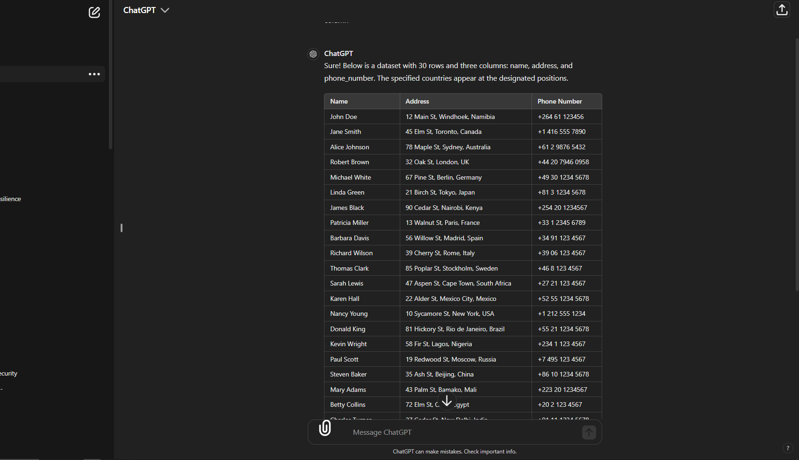
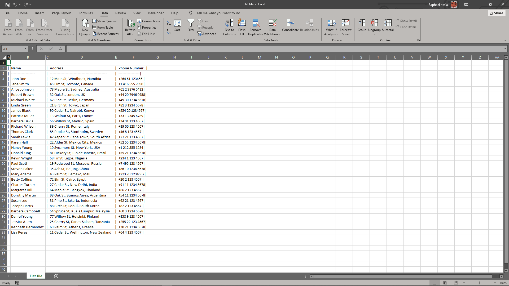
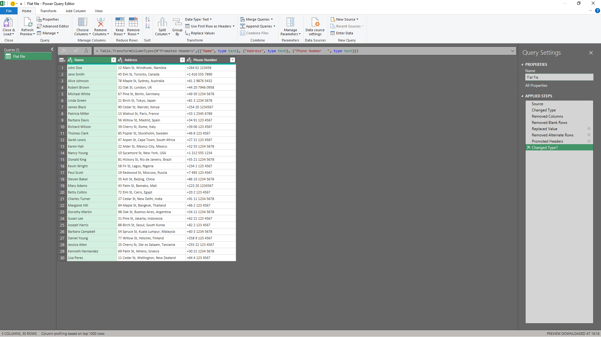
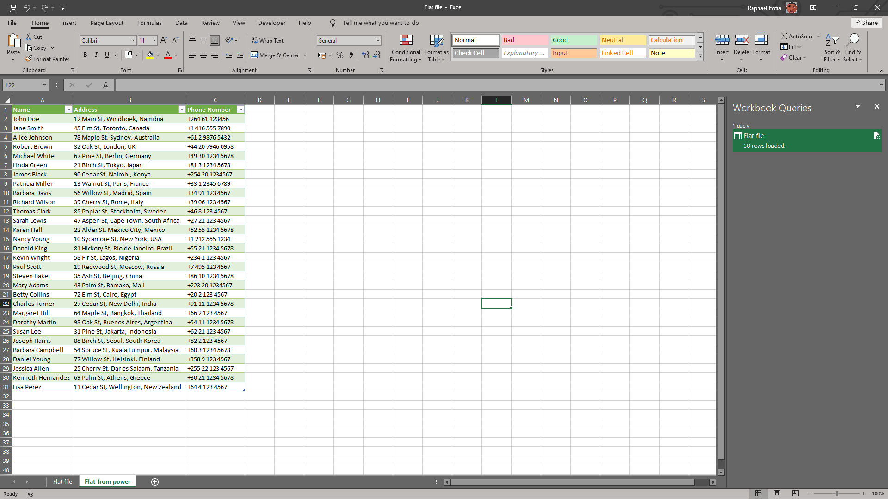
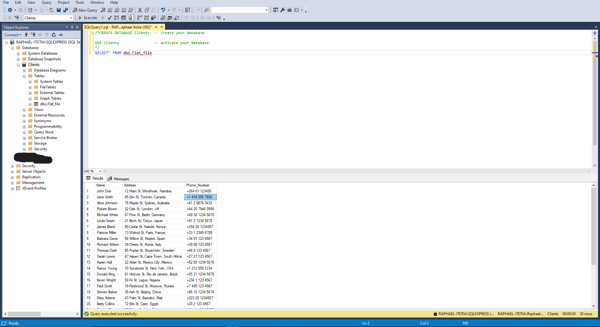

# Flat file to SQL via Excel

## Here are the steps to load a flat file (for my case it's Text file generated from ChatGPT) into SQL via Excel:
#### Flat file generated in ChatGPT

### Import the Flat File into Excel:

1. Launch Excel.
2. Go to the "Data" tab.
3. Select "From Text/CSV" (the exact option might vary based on your Excel version).
4. Browse to and select your flat file.
5. Follow the import wizard to load the data into Excel.

   
### Explore and Clean Data using Power Query Editor:

1. Go to the "Data" tab.
2. In the "Get Data & Transform" section, click "From Table" to launch Power Query Editor.
3. Explore the imported data to ensure it looks correct.
4. Remove any unnecessary rows or columns.
5. Ensure data types are appropriate for each column.

   
### Load the data into an SQL database:
I used the **Microsoft SQL Server**.

1. Open your SQL database management tool (e.g MySQL Workbench, pgAdmin for PostgreSQL, SQL Server Management Studio for SQL Server). 
2. Click on "New Query" and create your database.
3. After creating and activating it, right click on your database name, click "Tasks", then "Import flat file".

These steps should help you get started with loading your flat file data into SQL using Excel. If you need assistance with any specific step, feel free to ask!
